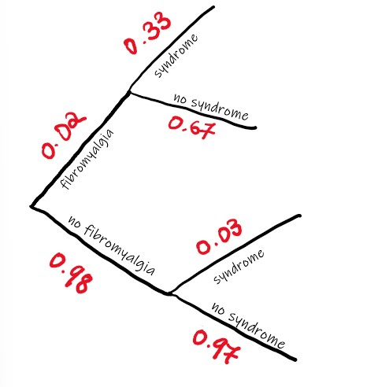
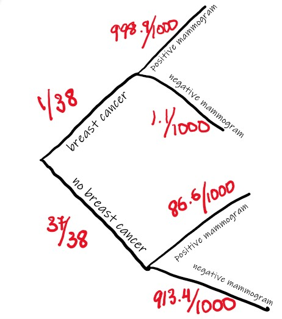

```{r, setup, include = FALSE, message=FALSE}
# load packages that are going to be used
require(mosaic)      # this loads ggformula (for plotting), etc. too
require(Lock5withR)  # this loads data sets from our book

# Some customization. You can alter or delete as desired (if you know what you are doing).

theme_set(theme_bw())     # change theme for ggplot2/ggformula

knitr::opts_chunk$set(
  tidy = FALSE,     # display code as typed (rather than reformatted)
  size = "small")   # slightly smaller font for code
```

Section 11.1

11.31

(a) It is simply an approximation so it may or may not be true for any random sample. 

(b) There are three possible outcomes but we don't know if they are equally likely, so we cannot say that the probability of each is 1/3. 

(c) The probability of getting a 1 on two consecutive rolls of dice is 1/6 * 1/6 = 1/36

(d) The probability cannot be greater than 1

11.32 
(a) P(C) = 0.2 
P(W) = 0.09 
P(C and W) = 0.02 
    
(b) P(C or W) = P(C) + P(W) - P(C and W) = 0.2 + 0.09 - 0.02 = 0.27

(c) P(C|W) = P(C and W)/P(W) = 0.02/0.09 = 0.22

(d) P(W|C) = P(W and C)/P(C) = 0.02/0.2 = 0.1

(e) P(not C) = 1 - P(C) = 1 - 0.2 = 0.8

(f) When C and W are disjoint sets, it means that there are no comedy movies produced by Warner Bros. No the events C and W are not disjoint because P(C and W) = 0.02. 

(g) Yes they are independent because one event is not affected by the other. 


11.34 
(a) P(Is a performer) = 181/273
(b) P(Does not have any female members) = 232/273
(c) P(Has female members if it is a performer) = 32/181
(d) P(Is not a performer if it has no female members) = 83/232
(e) P(Is a performer with no female members) = 149/273
(f) P(Is either not a performer or has female members) = 124/273


11.36
(a) P(red) = 11/80
(b) P(blue) = 20/80 = 2/8 = 1/4
    P(not blue) = 1-1/4 = 3/4
(c) P(red or orange) = (11+12)/80 = 23/80
(d) P(first and second are blues) = (20/80)^2 = (1/4)^2 = 1/16
(e) P(first red, second green) = (11/80) * (11/79) = 121/6320


11.39
(a) P(male color blind) = 7/100
(b) P(female not color blind) = 1 - P(female color blind)
                              = 1 - (0.4/100)
                              = 99.6/100
(c) P(Neither color blind) = P(man not color blind) * P(woman not color blind) = (1-0.07)*(1-0.004) = 0.927

(d) P(atleast on color blind) = P(male has it but female doesn't) + P(male doesn't have it but female does) + P(both of them have it) = (0.07*(1-0.004)) + (0.004*(1-0.07)) + (0.07*0.004) = 0.074

Section 11.2

11.57 

P[A] = P[fibromyalgia]
P[B] = P[restless leg syndrome]

P[A|B] 
= (0.02*0.33)/(0.02*0.33) + (0.98*0.03)
= 0.183


11.58

P[A] = P[has breast cancer]
P[B] = P[positive mammogram]

P[A|B] 
= (0.0263*0.9989)/(0.0263*0.9989) + (0.9737*0.0866)
= 0.23754
= 0.24

Section 11.3

11.83 
(a) Sum of probabilities = 0.217 + 0.363 + 0.165 + 0.145 + 0.067 + 0.026 + 0.018 = 1.001 = 1.0 

(b) Probability = 0.217 + 0.363 =  0.58 

(c) Probability = 0.067 + 0.026 + 0.018 = 0.111

(d) Probability = 1 - P(unit with one person) = 1 - 0.217 = 0.783

11.87 
(a) P( fruit flies dying in their second month) = 1 - (0.30 + 0.20 + 0.15 + 0.10 + 0.05) = 1 - 0.8 = 0.2

(b) P(fruit fly lives more than four months) = 0.10 + 0.05 = 0.15 

11.89 
(a)  
P[A] = P[died in first month] 

P[B] = P[dies before end of second month] 

P(A|B) = P[A and B]/P[B] = P[A] 0.3/(0.3 + 0.2) = 0.3/0.5

(b) 
P[C] = P[live more than four months]
P[D] = P[lives past second month]
P(C|D) = P[C and D]/P[D] = (0.10 + 0.05)/(0.20 + 0.15 + 0.10 + 0.05) = 0.15/0.5 = 0.53


Section 11.4

11.117 
P(X=0) = (0.51*0.51*0.51)   = 0.1327
P(X=1) = 3C1 * 0.49^1 * 0.51^2 = 0.3823
P(X=2) = 3C2 * 0.49^2 * 0.51^1 = 0.3674
P(X=3) = 3C3 * 0.49^3 * 0.51^0 = 0.1176

X       0       1       2       3
P(X)    0.133   0.002   0.002   0.118

11.120 
P[A] = P[65 or older] = 13/100
P[B] = P[not 64 or older] = 87/100

P(X=3) 
```{r}
dbinom(3, 10, 0.13) 
```
P(X=4) 
```{r}
dbinom(4, 10, 0.13) 
```

11.127
(a)

P(X=7) = [8!/7!(8-7)!] * (
(p)^7) * (1-p)^(8-7) = 8 * (0.881)^7 * (1-0.881)^1 = 8 * 0.412 * 0.119 = 0.392224 = 0.392

P(X=8) = [8!/8!(8-8)!] * (0.881)^8 * (0.119)^(8-8) = 1 * 0.363 * 1 = 0.363 

P(atleast 7) = P(X=7) + P(X=8) = 0.392 + 0.363 = 0.755

(b) 
```{r}
sum(dbinom(70:80, 80, 0.881))
```

5.1
(a) HH, HT, TH, TT
(b) 12, 13, 14, 15, 21, 23, 24, 25, 31, 32, 34, 35, 41, 42, 43, 45, 51, 52, 53, 54 = 16 ways 

5.3 A reasonable listing would include the shortest to the longest heights. Maybe some range like 4.0 - 6.2 would be a good range. 

5.4 It means that there is a 70% chance of snowing. A frequentivist interpretation would mean that if it kept on snowing, then there would be 70% chance of snow. Subjectivist would say there would be rain 70% chance of snow in certain areas.  

5.5 
(a) 4^2 outcomes
    {HHHH, HHHT, THHT, HHTH, HTHH, THHH,
    TTHH, THTH, THHT, HTTH, HHTT, 
    HTTT, TTTH, THTT, TTHT, TTTT}

(b) p(0) = 0.0625
    p(1) = 0.25
    p(2) = 0.375
    p(3) = 0.25
    P(4) = 0.0625
    
5.6
(a) Outcomes = 2^10 = 1024
(b) 10
(c) p(1) = 0.01
(d) p(9)

5.9
(4/10) * (3/9) = 0.13

5.11
```{r}
n = 1000
num_flips = sample(c(0,1), replace=TRUE, size=n) 

num_flips

```
504

(b) It would be likely that an increase in sample size will lead to increase in the proportion of heads. 

5.15 
(a) Because they are different sizes so they can't have equally likely outcomes 

(b) For equally likely outcomes, the probability would be 1/14 

5.18 
a & b
```{r}
pbinom(4500, 10000, .45)

pbinom(900, 2000, 0.45)
```

5.19 
(a) p(with replacement) = 0.163

(b) p(without replacement) = 0.323
